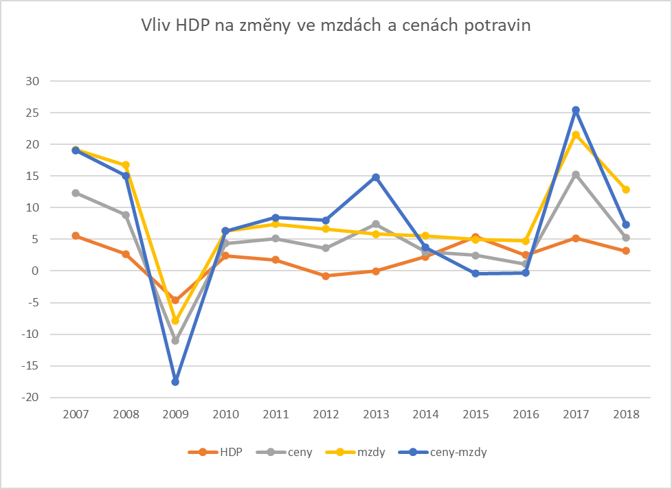

# ODPOVĚDI NA VÝZKUMNÉ OTÁZKY

## 1. Rostou v průběhu let mzdy ve všech odvětvích, nebo v některých klesají?

V letech **2001** až **2008**, **2012** a **2017** až **2019** rostly mzdy ve všech odvětvích.

Pouze ve čtyřech z 19 odvětví rostly mzdy ve všech zkoumaných letech (2000 - 2021):
- Doprava a skladování 
- Ostatní činnosti
- Zdravotní a sociální péče
- Zpracovatelský průmysl

V některých odvětvích poklesla mzda pouze nepatrně:
- Administrativní a podpůrné činnosti v roce *2013* o **-0,36 %**
- Informační a komunikační činnosti *2013* o **-1,01 %**
- Velkoobchod a maloobchod; opravy a údržba motorových vozidel v roce *2013* o **-0,94 %**
- Zásobování vodou, činnosti související s odpady a sanacemi v roce *2013* o **-0,38 %**

V jiných odvětvích byl pokles mzdy výraznější i více krát:
- Činnosti v oblasti nemovitostí v roce *2013* o **-1,7 %** a *2020* o **-7 %**
- Kulturní, zábavní a rekreační činnosti v roce *2011* o **-0,05 %**, *2013* o **-1,37 %** a *2021* o **-3,03 %**
- Peněžnictví a pojišťovnictví v roce *2013* o **-8,91**
- Profesní, vědecké a technické činnosti v roce *2010* o **-0,61 %** a *2013* o **-2,91 %**
- Stavebnictví v roce *2013* o **-2,13 %** a *2021* o **-0,59 %**
- Těžba a dobývání v roce *2009* o **-3,74 %**, *2013* o **-2,85 %**, *2014* o **-0,79 %** a *2016* o **-0,59 %** 
- Ubytování, stravování a pohostinství v roce *2019* o **-1,2 %**, *2011* o **-1,11 %** a *2020* o **-5,88 %**
- Veřejná správa a obrana; povinné sociální zabezpečení v roce *2010* o **-0,33 %**, *2011* o **-2,24 %** a *2021* o **-2,27 %**
- Výroba a rozvod elektřiny, plynu, tepla a klimatiz. vzduchu v roce *2013* o **-4,37 %** a *2015* o **-1,31 %**
- Vzdělávání v roce *2010* o **-1,84 %** a *2021* o **-2,65 %**
- Zemědělství, lesnictví, rybářství v roce *2009* o **-0,62 %** a *2021* o **-3,8 %**

Nejvíce krát byl pokles mzdy napříč odvětví v roce **2013**. Nejvýraznější pokles ze všech odvětví zaznamenalo v roce **2013** *peněžnictví a pojišťovnictví* (**-8,91 %**). Konkrétně snížení mzdy v průměru o **4479 Kč**.
Pokud se podíváme na nejvýraznější růst - ve *zdravotnictví a sociální péči* se v roce **2021** navýšily průměrně mzdy o **5823 Kč** (**14.72 %**). Stojí za zmínku, že nejvyšší procentuální meziroční nárust mzdy zaznamenaly informační a komunikační činnosti v roce *2001* o **15,22 %**.

## 2. Kolik je možné si koupit litrů mléka a kilogramů chleba za první a poslední srovnatelné období v dostupných datech cen a mezd?

V roce *2006* bylo možné si koupit za průměrnou hrubou mzdu **1287 kg chleba** nebo **1437 l mléka**.

V roce *2018* bylo možné si koupit za průměrnou hrubou mzdu **1342 kg chleba** nebo **1642 l mléka**.

## 3. Která kategorie potravin zdražuje nejpomaleji (je u ní nejnižší percentuální meziroční nárůst)?

Za celé období (2006 - 2018) zlevnil cukr krystal o **27,52 %**, kdy v roce 2006 stál *21,73 Kč*, zatímco v roce 2018 se prodával 1 kg za **15,75 Kč**.
Ještě rajská jablka červená kulatá zaznamenala pokles ceny o **23,07 %*. Všechny ostatní potraviny v průběhu let zdražily.
Stojí za zmínku, že k největšímu zdražení došlo u másla a to o **98,37 %**, z *104,39 Kč* za 1 kg na *207,08 Kč*.

Pokud se podíváme na růst/pokles cen v jednotlivých letech, v roce *2007* byl největší procentuální meziroční pokles u rajských jablek (**-30,28 %**). Ve stejném roce došlo k **94,82 %** zdražení u paprik.

## 4. Existuje rok, ve kterém byl meziroční nárůst cen potravin výrazně vyšší než růst mezd (větší než 10 %)?

Ve zkoumaném období (2006 - 2018) *nebyl* zaznamenán rok, kdy by rozdíl mezi růstem cen potravin a růstem mezd byl větší než **10 %**.
Nejlépe na tom byli lidé v roce *2009*, nejenže zlevnily potraviny o **-6,42 %**, ale mzdy navíc vzrostly o **3,16 %**.
Naopak v roce *2013* zdražily potraviny o **7,46** a mzdy se snížily o **-1,56 %**.
Nejvýraznější růst cen potravin byl v roce *2017* o **10,12**, což bylo částečně kompenzováno růstem mezd o **6.28 %**.

## 5. Má výška HDP vliv na změny ve mzdách a cenách potravin? Neboli, pokud HDP vzroste výrazněji v jednom roce, projeví se to na cenách potravin či mzdách ve stejném nebo následujícím roce výraznějším růstem?

Pro lepší představu o změnách HDP, mzdách a cenách potravin je přiložen graf.

